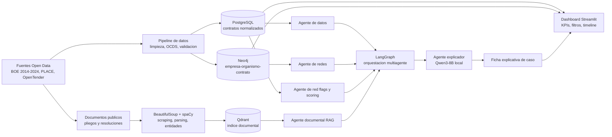

# Planificacion del TFM

## Titulo provisional

**ProcureWatch Analytics: plataforma multiagente para la deteccion de patrones de riesgo en contratacion publica mediante Open Data, analisis de redes, NLP y modelos locales.**

## Datos academicos

- Director del TFM: **Enrique de Miguel Ambite**.
- Equipo de trabajo: Sebastian Alfonso Correa y Saturia Maria Hurtado Alvarez.
- Fecha base de replanificacion: **18 de mayo de 2026**.

## Enfoque del trabajo

ProcureWatch Analytics se plantea como un prototipo analitico reproducible para detectar, cuantificar y visualizar patrones de riesgo en contratacion publica espanola y europea. El sistema no declara fraude ni sustituye a un organo auditor: prioriza casos, explica senales de riesgo y facilita la revision humana.

El nucleo academico del TFM esta en el analisis de datos masivos: integracion de fuentes heterogeneas, normalizacion OCDS, construccion de indicadores de red flags, analisis de redes, deteccion de anomalias y visualizacion explicable. Los modelos locales, web scraping, RAG y agentes tienen un papel instrumental para extraer, organizar y explicar informacion.

## Objetivo general

Disenar, desarrollar y evaluar un prototipo de plataforma analitica multiagente que, a partir de datos abiertos de contratacion publica, detecte y visualice patrones de riesgo en licitaciones, adjudicaciones y empresas adjudicatarias mediante red flags, scoring de anomalias, analisis de redes, NLP documental y fichas explicables de caso.

## Objetivos especificos

1. Estudiar el ciclo de contratacion publica espanola, las fuentes disponibles y las variables relevantes para red flags.
2. Definir un modelo de datos analitico armonizado con OCDS para contratos, licitaciones, adjudicatarios, organos de contratacion y relaciones.
3. Implementar un pipeline reproducible de descarga, limpieza, normalizacion, enriquecimiento y carga de datos.
4. Desarrollar un motor de red flags con indicadores basados en literatura, reglas parametrizables y modelos de anomalias.
5. Construir un grafo empresa-organismo-contrato para detectar concentracion, centralidad, comunidades y relaciones recurrentes.
6. Implementar una prueba documental con web scraping/NLP/RAG sobre anuncios, resoluciones o documentos publicos seleccionados en formato HTML o texto reutilizable.
7. Desarrollar una interfaz analitica con panel de riesgo, grafo interactivo, evolucion temporal y ficha explicativa.
8. Evaluar el sistema mediante metricas de calidad de datos, scoring, redes, recuperacion documental y usabilidad.

## Alcance

### Alcance incluido

- Dataset longitudinal BOE 2014-2024 como base principal.
- Datos de PLACE y OpenTender Espana como fuentes complementarias cuando aporten variables o indicadores utiles.
- Normalizacion minima al estandar OCDS.
- Analisis prioritario de contratos espanoles, con seleccion argumentada de sector, tipo de contrato o CPV.
- Red flags de concurrencia, procedimiento, concentracion, desviacion de importe, temporalidad y recurrencia.
- Analisis de redes bipartitas o tripartitas entre organismos, adjudicatarios y contratos.
- PoC documental sobre una muestra acotada de documentos publicos.
- Prototipo local con dashboard y fichas explicables.

### Fuera de alcance

- Declaraciones juridicas de fraude o culpabilidad.
- Sistema productivo para administraciones publicas.
- Integracion completa en tiempo real con todas las fuentes de PLACE.
- Uso de datos personales no publicados bajo obligaciones de transparencia.
- Entrenamiento intensivo de LLMs desde cero.
- Enriquecimiento societario exhaustivo si no hay fuente abierta, trazable y legalmente reutilizable.

## Preguntas de investigacion

1. Que indicadores observables permiten detectar patrones de riesgo en contratacion publica espanola?
2. Como mejora el analisis de redes la deteccion de concentracion, recurrencia y relaciones atipicas entre organismos y empresas?
3. Que aporta el procesamiento documental para contextualizar o explicar posibles indicios de direccionamiento tecnico?
4. Como debe visualizarse el riesgo para que sea interpretable y util en una tarea de supervision?
5. Que limitaciones aparecen al trabajar con datos abiertos reales sin etiquetas completas de fraude?

## Metodologia

El proyecto seguira una metodologia iterativa adaptada de CRISP-DM, combinada con desarrollo incremental por modulos:

1. Comprension del dominio: contratacion publica, red flags, marco normativo y fuentes abiertas.
2. Comprension de datos: perfilado del dataset BOE, PLACE y OpenTender; analisis de cobertura y calidad.
3. Preparacion de datos: limpieza, normalizacion OCDS, validacion de identificadores y carga analitica.
4. Modelado analitico: reglas de red flags, scoring compuesto y modelos de deteccion de anomalias.
5. Analisis de redes: construccion de grafos, centralidades, comunidades y variables derivadas.
6. NLP documental: web scraping/parsing HTML, extraccion de entidades, indexacion y recuperacion de contexto.
7. Visualizacion: dashboard exploratorio, grafo interactivo, timeline y fichas explicativas.
8. Evaluacion: metricas tecnicas, analisis cualitativo de casos, limitaciones y redaccion de memoria.

## Fuentes de datos

| Fuente | Uso previsto | Prioridad |
|---|---|---:|
| BOE 2014-2024 en OCDS | Base longitudinal principal de contratos estructurados | Alta |
| PLACE datos abiertos | Contraste, ampliacion y descarga de licitaciones/documentos | Alta |
| OpenTender.eu | Indicadores precalculados y comparacion europea/Espana | Media |
| TED UE | Contratos por encima de umbrales comunitarios | Media |
| OCDS Red Flags Reference | Catalogo metodologico de indicadores | Alta |
| Datos abiertos complementarios | Contexto territorial, sectorial o institucional | Baja |

Decision de alcance recomendada: comenzar con BOE 2014-2024 y OpenTender Espana. PLACE se usara para complementar documentos o variables cuando sea viable.

## Arquitectura de trabajo

La arquitectura logica se divide en los siguientes modulos:

- `data/raw/`: datos originales descargados.
- `data/processed/`: datasets limpios, normalizados y versionables.
- `data/processed_sample/`: salidas de prueba, separadas de resultados finales.
- `data/synthetic/`: muestras reproducibles para desarrollo.
- `scr/procurewatch/agent1/`: ingesta, validacion, normalizacion OCDS y entrega canonica.
- `scr/procurewatch/agent2/`: reglas, scoring y modelos de anomalias.
- `scr/procurewatch/agent3/`: futuro modulo de grafos y relaciones.
- `scr/procurewatch/agent4/`: web scraping/parsing HTML, NLP, embeddings, Qdrant y RAG documental.
- `scr/procurewatch/data_sources/`: conectores/parsers de fuentes externas.
- `models/`: configuracion de modelos locales o artefactos entrenados.
- `api/`: servicios de consulta para dashboard o agentes.
- `frontend/`: Streamlit/dashboard, Plotly y visualizacion de grafo.
- `notebooks/`: exploracion, validacion y resultados reproducibles.
- `docs/`: documentacion metodologica, planificacion, memoria y guias.
- `tests/`: pruebas unitarias, integracion y regresion.

Regla de responsabilidad: `data/` almacena datasets y artefactos generados;
`scr/procurewatch/data_sources/` almacena codigo para leer fuentes externas;
`scr/procurewatch/agentN/` almacena la logica de cada agente.

## Herramientas previstas

| Area | Herramientas |
|---|---|
| Analisis de datos | Python, pandas, Polars, scikit-learn |
| Base relacional | PostgreSQL |
| Grafos | NetworkX, Neo4j Community, python-louvain |
| Scraping/NLP | BeautifulSoup, spaCy, modelos locales via Ollama |
| RAG | Qdrant, BGE-M3 u otro embedding multilingue, RAGAS |
| Agentes | LangGraph |
| Visualizacion | Streamlit, Plotly, PyVis/Sigma.js |
| Reproducibilidad | Docker, Git, notebooks, scripts parametrizados |

## Stack tecnologico definitivo

| Capa | Decision | Justificacion |
|---|---|---|
| Lenguaje principal | Python | Ecosistema maduro para datos, NLP, ML, grafos y prototipado academico reproducible |
| Procesamiento tabular | pandas y Polars | pandas por compatibilidad; Polars para volumen y eficiencia cuando el dataset lo requiera |
| Persistencia relacional | PostgreSQL | Modelo analitico trazable para contratos, organismos, adjudicatarios y scores |
| Grafo | Neo4j Community y NetworkX | Neo4j para exploracion/consulta; NetworkX para metricas reproducibles en scripts |
| Orquestacion multiagente | LangGraph | Control explicito del flujo de estados entre agentes y trazabilidad de decisiones |
| LLM local | **Qwen3-8B via Ollama** | Modelo local equilibrado para explicaciones, generacion de fichas y privacidad de datos |
| Embeddings | BGE-M3 | Soporte multilingue y buen ajuste para recuperacion documental en espanol |
| Vector store | Qdrant | Indexacion local de documentos y recuperacion semantica trazable |
| Web scraping/parsing | BeautifulSoup | Extraccion estructurada de anuncios BOE/PLACE y paginas publicas reutilizables |
| NLP clasico | spaCy | Extraccion de entidades y normalizacion linguistica en espanol |
| Dashboard | Streamlit, Plotly y PyVis/Sigma.js | Prototipo rapido con visualizacion tabular, temporal y de grafos |
| Evaluacion RAG | RAGAS | Metricas de faithfulness, relevancia y recuperacion |
| Reproducibilidad | Docker, Git y scripts parametrizados | Ejecucion local verificable y defensa tecnica del prototipo |

## Implicaciones normativas del AI Act para el scoring

El score de riesgo se tratara como una herramienta de apoyo analitico y no como una decision automatizada. Dado que puede priorizar contratos, organismos o adjudicatarios para revision, el diseno debe incorporar medidas propias de sistemas de riesgo elevado o sensible:

- Supervision humana obligatoria: ninguna ficha puede afirmar fraude ni generar consecuencias automaticas.
- Trazabilidad completa: cada score debe conservar fuente, version de datos, red flags activadas, pesos y fecha de calculo.
- Explicabilidad por caso: el dashboard debe mostrar por que un contrato obtiene un nivel de riesgo concreto.
- Gestion de sesgos y calidad de datos: el informe debe documentar nulos, cobertura, errores de identificadores y limitaciones por fuente.
- Proporcionalidad: el score solo debe usarse para priorizar revision, no para clasificar juridicamente a empresas o personas.
- Registro de limitaciones: ausencia de etiquetas completas de fraude, posible sesgo de publicacion, variabilidad entre organismos y restricciones de reutilizacion.
- Privacidad y minimizacion: usar solo datos publicados por obligaciones de transparencia y evitar datos personales adicionales no necesarios.

## Diagrama de arquitectura del sistema multiagente

## Paquetes de trabajo

### PT0. Formacion y configuracion

Entregables:

- Entorno local configurado con Python, Docker, PostgreSQL, Neo4j, Qdrant, Ollama y GitHub Copilot.
- Qwen3 u otro modelo local funcionando.
- Repositorio organizado y documentado.

Criterio de cierre: entorno ejecutable y reproducible por ambos integrantes.

### PT1. Dominio, estado del arte y marco normativo

Entregables:

- Revision de open data, OCDS, PLACE, BOE, OpenTender y DIGIWHIST.
- Revision de red flags, corrupcion en contratacion, machine learning, redes, NLP documental y explicabilidad.
- Sintesis normativa: LCSP, transparencia, RGPD/LOPDGDD, AI Act y reutilizacion de informacion publica.
- Minimo diez referencias de calidad para el primer borrador.

Criterio de cierre: estado del arte con brecha clara que justifique ProcureWatch Analytics.

### PT2. Datos y modelo analitico

Entregables:

- Seleccion definitiva de fuentes.
- Modelo de datos OCDS adaptado.
- Esquema PostgreSQL y esquema de grafo Neo4j.
- Informe de exploracion y calidad: nulos, duplicados, fechas, importes, NIF, cobertura temporal y organismos.

Criterio de cierre: dataset base cargado, perfilado y documentado.

### PT3. Pipeline de datos

Entregables:

- Scripts de descarga/carga del dataset BOE.
- Normalizacion de campos clave: contrato, licitacion, adjudicatario, organismo, fechas, importes, procedimiento y CPV.
- Validacion de NIF y coherencia temporal.
- Exportacion reproducible a CSV/Parquet y carga en PostgreSQL.

Criterio de cierre: pipeline repetible desde datos brutos hasta datos analiticos.

### PT4. Motor de red flags y scoring

Entregables:

- Catalogo de indicadores priorizados.
- Implementacion de RF-01 a RF-06 como minimo: licitacion unica, procedimiento restringido/menor recurrente, concentracion por proveedor, desviacion de importe, plazos anomalos y recurrencia organismo-proveedor.
- Score compuesto por contrato, adjudicatario y organismo.
- Comparativa con Isolation Forest y, si hay etiquetas parciales, Positive-Unlabeled Learning.

Criterio de cierre: ranking de casos priorizados con explicacion de factores de riesgo.

### PT5. Analisis de redes

Entregables:

- Grafo empresa-organismo-contrato consultable.
- Metricas de grado, intermediacion, centralidad, concentracion y comunidades.
- Deteccion de comunidades Louvain/Leiden y relaciones recurrentes.
- Variables de red integradas en el scoring.

Criterio de cierre: informe de red con comunidades y entidades atipicas identificadas.

### PT6. Web scraping, NLP y RAG documental

Entregables:

- Muestra documental de pliegos, resoluciones o memorias justificativas.
- Extraccion con BeautifulSoup y spaCy.
- Extraccion de entidades: organismos, empresas, importes, fechas, criterios tecnicos y CPV.
- Indexacion en Qdrant y recuperacion de contexto por caso.
- Evaluacion basica con RAGAS.

Criterio de cierre: PoC documental capaz de aportar contexto trazable a una ficha de caso.

### PT7. Sistema multiagente y front-end

Entregables:

- Agente de datos, agente de scoring, agente documental y agente explicador orquestados con LangGraph.
- Dashboard con KPIs, filtros, timeline, grafo interactivo y ficha de caso.
- Integracion basica front-end/backend/agentes.
- Demo funcional.

Criterio de cierre: prototipo navegable e integrado.

### PT8. Evaluacion, memoria y defensa

Entregables:

- Evaluacion del pipeline, scoring, redes, RAG e interfaz.
- Analisis de casos de alto riesgo y discusion de limitaciones.
- Memoria final en plantilla UNIR.
- Repositorio documentado, presentacion y demo de defensa.

Criterio de cierre: memoria completa y prototipo defendible.

## Cronograma detallado

La planificacion queda gobernada por las fechas reales de entrega:

| Hito | Fecha limite | Objetivo | Entregables comprometidos |
|---|---:|---|---|
| Entrega 2 | **20/05/2026** | Consolidar propuesta tecnica y Capitulo 5 | Nombre del director corregido, Capitulo 5 desarrollado, stack definitivo, AI Act, diagrama multiagente y referencias con DOI/URL |
| Entrega 3 | **24/06/2026** | Entregar prototipo tecnico y evaluacion preliminar | Pipeline funcional, datos normalizados, primeras red flags, grafo inicial, PoC documental, dashboard basico y avance de resultados |
| Predeposito | **15/07/2026** | Cerrar memoria y prototipo defendible | Memoria completa, evaluacion final, repositorio documentado, demo integrada y presentacion preliminar |

### Plan operativo hasta Entrega 2: 20/05/2026

| Fecha | Tarea | Responsable | Criterio de cierre |
|---|---|---|---|
| 18/05 | Corregir metadatos academicos | Ambos | Director indicado como Enrique de Miguel Ambite |
| 18/05 | Definir stack tecnologico definitivo | Ambos | Qwen3-8B seleccionado y justificado; tabla de tecnologias cerrada |
| 18-19/05 | Desarrollar Capitulo 5 | Ambos | Arquitectura tecnica, pipeline de datos e implementacion de agentes descritos |
| 19/05 | Completar marco normativo | Ambos | AI Act analizado con implicaciones sobre scoring de riesgo |
| 19/05 | Anadir diagrama de arquitectura multiagente | Saturia | Diagrama integrado en memoria/documentacion |
| 19/05 | Revisar referencias | Ambos | DOI o URL definitiva para cada fuente citada |
| 20/05 | Revision final de Entrega 2 | Ambos | Documento revisado, consistente y listo para entregar |

### Plan operativo hasta Entrega 3: 24/06/2026

| Periodo | Foco | Entregable | Responsable |
|---|---|---|---|
| 21-27 mayo | Setup tecnico y arquitectura ejecutable | Docker/entorno local, PostgreSQL, Neo4j, Qdrant y Ollama con Qwen3-8B | Ambos |
| 28 mayo-3 junio | Pipeline BOE/OpenTender | Datos brutos descargados, normalizados y cargados | Sebastian |
| 4-10 junio | Red flags y scoring v1 | RF-01 a RF-06 implementadas y score compuesto inicial | Sebastian |
| 11-17 junio | Grafo y PoC documental | Grafo organismo-adjudicatario-contrato; muestra documental procesada | Saturia |
| 18-23 junio | Dashboard y memoria tecnica | Dashboard basico, fichas de caso y resultados preliminares | Ambos |
| 24 junio | Revision Entrega 3 | Prototipo y memoria parcial entregables | Ambos |

### Plan operativo hasta predeposito: 15/07/2026

| Periodo | Foco | Entregable | Responsable |
|---|---|---|---|
| 25 junio-1 julio | Integracion y evaluacion | Pipeline, scoring, grafo, RAG y dashboard integrados | Ambos |
| 2-8 julio | Resultados y discusion | Analisis de casos, metricas, limitaciones y conclusiones preliminares | Ambos |
| 9-12 julio | Cierre de memoria | Memoria completa en plantilla UNIR, referencias revisadas | Ambos |
| 13-14 julio | Ensayo de defensa | Demo estable, presentacion preliminar y checklist de repositorio | Ambos |
| 15 julio | Predeposito | Version cerrada para revision academica | Ambos |

## Hitos principales

- **H1:** entorno configurado, fuentes seleccionadas y alcance validado.
- **H2:** modelo OCDS adaptado y arquitectura aprobada.
- **H3:** dataset BOE/OpenTender cargado y perfilado.
- **H4:** motor de red flags ejecutable y ranking de casos inicial.
- **H5:** grafo de contratacion con metricas y comunidades.
- **H6:** PoC scraping/NLP/RAG documentada.
- **H7:** dashboard integrado con fichas explicables.
- **H8:** evaluacion, memoria y defensa preparadas.

## Metricas de evaluacion

### Calidad del pipeline de datos

| Metrica | Objetivo |
|---|---:|
| Completitud de campos OCDS criticos tras normalizacion | > 90% |
| Tasa de NIF validos y normalizados | > 85% |
| Coherencia temporal publicacion-adjudicacion | > 98% |
| Trazabilidad de fuentes y transformaciones | 100% de datasets procesados |

### Calidad del motor de red flags

| Metrica | Objetivo |
|---|---:|
| Precision sobre ground truth parcial o reglas verificables | > 70% |
| Estabilidad del score ante variacion de umbrales +/-10% | Documentada |
| Ranking de red flags por frecuencia y peso | Disponible |
| Comparativa reglas vs. Isolation Forest vs. PU Learning | Disponible si los datos lo permiten |

### Calidad del analisis de redes

| Metrica | Objetivo |
|---|---:|
| Modularidad Louvain/Leiden | Q > 0.30 si hay estructura real |
| Correlacion entre centralidad y score de riesgo | Analizada |
| Comunidades o subredes densas explicadas | Al menos 3 casos |

### Calidad del RAG documental

| Metrica | Objetivo |
|---|---:|
| Faithfulness | > 0.80 |
| Answer relevancy | > 0.75 |
| Context recall | > 0.70 |
| Trazabilidad de fragmentos recuperados | 100% en fichas generadas |

### Calidad de interfaz

| Metrica | Objetivo |
|---|---:|
| SUS | > 68 |
| Tiempo para localizar e interpretar un caso | < 5 minutos |
| Claridad de ficha explicativa en escala Likert 1-5 | > 3.5 |

## Riesgos y mitigaciones

| Riesgo | Impacto | Mitigacion |
|---|---|---|
| Datos incompletos o heterogeneos | Alto | Documentar calidad, priorizar BOE/OpenTender y limitar campos obligatorios |
| Ausencia de etiquetas de fraude | Alto | Evaluar con anomalias, reglas verificables, literatura y casos documentados |
| Exceso de alcance tecnico | Alto | Priorizar pipeline, red flags, grafos y dashboard; dejar RAG como PoC acotada |
| Limitaciones de PDFs no estructurados | Medio | Priorizar fuentes HTML/PLACE reutilizables y registrar los PDFs no procesables como limitacion |
| Complejidad de Neo4j/Qdrant/LangGraph | Medio | Integracion incremental y alternativas simples en Python si hay bloqueo |
| Riesgos legales o de privacidad | Alto | Usar solo datos publicos, no emitir juicios juridicos y exigir supervision humana |
| Retrasos en memoria | Alto | Redactar cada capitulo al cerrar su paquete de trabajo |

## Division de responsabilidades

| Responsable | Foco principal |
|---|---|
| Sebastian Alfonso Correa | Pipeline de datos, PostgreSQL, normalizacion OCDS, red flags, scoring y modelos de anomalias |
| Saturia Maria Hurtado Alvarez | Analisis de redes, Neo4j/NetworkX, web scraping/NLP/RAG, visualizacion de grafos y front-end |
| Ambos | Estado del arte, arquitectura, integracion, evaluacion, memoria, presentacion y defensa |

## Estructura recomendada de la memoria

1. Introduccion y motivacion.
2. Contexto y estado del arte.
3. Objetivos concretos y metodologia.
4. Marco normativo.
5. Desarrollo especifico de la contribucion: pipeline, red flags, redes, NLP/RAG y front-end.
6. Codigo fuente y datos analizados.
7. Evaluacion y resultados.
8. Conclusiones.
9. Limitaciones y trabajo futuro.

## Proximas acciones inmediatas

1. Corregir en la memoria el nombre del director: **Enrique de Miguel Ambite**.
2. Desarrollar el Capitulo 5 con arquitectura tecnica, pipeline de datos e implementacion de agentes.
3. Dejar cerrado el stack tecnologico definitivo con **Qwen3-8B** como modelo local.
4. Completar el marco normativo con analisis del AI Act e implicaciones del scoring de riesgo.
5. Incorporar el diagrama de arquitectura del sistema multiagente.
6. Revisar referencias y anadir DOI o URL definitiva en cada cita.
7. Preparar la Entrega 2 para el **20/05/2026**.

## Replanificacion operativa inmediata 31/05/2026

Objetivo del bloque actual:

- Agent2: plantear red flags y scoring sobre el dataset canonico de Agent1.
- Agent4: avanzar con NLP, scraping, RAG, Qdrant, Ollama y estructura LangGraph/LangChain.
- Capa de datos: preparar PostgreSQL, Neo4j y Qdrant con IDs compartidos.
- Stack local: instalar Docker Desktop, PostgreSQL, Neo4j, Qdrant via Docker, Ollama y modelos.

Prioridad de ejecucion:

1. Validar `run-agent1` y congelar `agent2_contracts_canonical.parquet` como entrada.
2. Crear esquema minimo PostgreSQL.
3. Definir red flags v1 de Agent2.
4. Generar nodos/edges para Neo4j desde el canonico.
5. Mantener y ampliar `scr/procurewatch/agent4/`.
6. Preparar coleccion Qdrant `procurement_documents`.
7. Ejecutar primera PoC de recuperacion documental.
## Cierre de sesion 31/05/2026

Agent1 ya ejecuta BOE, PLACE y OpenTender, reutiliza cache de outputs procesados, genera reporte de ejecucion, cobertura por fuente, resumen de calidad y dataset canonico para Agent2. Queda pendiente mejorar el enlace entre fuentes porque las intersecciones actuales por `contract_key_canon` son 0.
